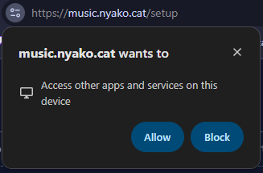
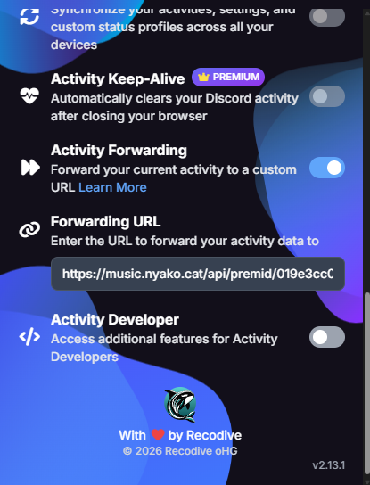

import { LinkCard } from '@astrojs/starlight/components';

# Choose your fighter

Depending on your music source, you may need to use a third-party app or website to send your song info to the widget:

| Music source | Host app/website |
| ------------- | ------------- |
| Spotify (w/ Premium) | Official API, no extras needed |
| Spotify (without Premium) | [Last.fm](https://last.fm) API key |
| YouTube Music | [Pear Desktop](https://github.com/pear-devs/pear-desktop) |
| Apple Music | [Cider](https://cider.sh/downloads/client) Version 2 (paid, $3 USD) |
| Soundcloud | Official API* *or* [Last.fm](https://last.fm) API w/ [Web Scrobbler](https://webscrobbler.com/) |
| Last.FM (any source)| [Last.fm](https://last.fm) API w/ [Web Scrobbler](https://webscrobbler.com/) |
| PreMid presences | PreMiD extension w/ Activity Forwarding enabled |
| Anything and everything else! | [Nutty's SMTC bridge](https://github.com/nuttylmao/smtc-bridge/releases/latest) |

[Pano Scrobbler](https://github.com/kawaiiDango/pano-scrobbler) should work too and seems to be wayy better than web scrobbler 
(haven't tested it)

# Source Setup

:::caution[Important!]
If a prompt appears asking to access apps on your device, you must click allow. 

Without doing so, the widget can't connect to the music apps on your computer (like Pear Desktop)

The prompt looks like this on Chromium based browsers:

:::

## Apple Music

Apple Music is supported through [Cider](https://cider.sh) (version 2), a third-party Apple Music client.

<LinkCard title="Using Apple Music (via Cider)" href="/music-overlay/music-sources/cider" />

## YouTube Music

YouTube Music works through [Pear Desktop](https://github.com/pear-devs/pear-desktop), a desktop app that wraps YouTube Music and hosts a local API.
It also has plenty of useful plugins such as Adblock!

<LinkCard title="Using YouTube Music" href="/music-overlay/music-sources/pear-desktop" />

## Spotify

Surely you all know what Spotify is and does

:::caution[Heads up]
Spotify API requires **Spotify Premium**. If you're a free user, use the [SMTC Bridge](#other-music-players) OR [Last.fm](#lastfm) sources instead
:::

<LinkCard title="Using the Spotify API" href="/music-overlay/music-sources/spotify" />

## Last.fm

Last.fm is a website to track your listening history and compare your listening habits with other users.
 It tracks what you play from any source you submit to it (a 'scrobble')

<LinkCard title="Using Last.fm" href="/music-overlay/music-sources/lastfm" />

## SoundCloud

The page below covers the SoundCloud API. For soundcloud scrobbling support, use last.fm.

<LinkCard title="Using SoundCloud" href="/music-overlay/music-sources/soundcloud" />

## PreMid

To use PreMid, enable Activity Forwarding in the extension's settings.
Set the Forwarding URL to the `PreMid API Endpoint` link you copied on the setup page.

**Do not enter the Widget Link!** their extension will not know what to do with our widget. lmao

## Other music players

The widget supports any music source playing on your computer by using a bridge application!

<LinkCard title="Using SMTC Bridge" href="/music-overlay/music-sources/smtc-bridge" />
