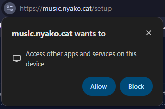

:::caution[Important!]
If a prompt appears asking to access apps on your device, you must click allow. If you don't, the widget can't connect to local apps like YouTube Music/Cider.

:::

## YouTube Music

YouTube Music works through [Pear Desktop](https://github.com/pear-devs/pear-desktop), a desktop app that wraps YouTube Music and exposes a local API.
It also has plenty of useful plugins such as Adblock!

Open Pear, click **Plugins** in the top left, move down to `API Server [Beta]`.
If it's not already enabled (and you don't see a right arrow next to it) click to enable it!

Go to the widget setup page, leave everything as default, and click Request Authorization.

## Spotify

:::caution[Heads up]
Spotify API requires **Spotify Premium**. If you're a free user, use the [Last.fm method](#using-spotify-with-lastfm-free-spotify-workaround) instead
:::

### Create a Spotify Developer App

Go to the [Spotify Developer Dashboard](https://developer.spotify.com/dashboard) and sign in.

Click **"Create App"** and fill in:

- **App name:** Nyan Music Overlay
- **App description:** Anything you want
- **Redirect URI:** `https://music.nyako.cat/setup`
- **Which API/SDKs are you planning to use?** Select "Web API"

Click **"Save"**.

On your app's settings page, copy the **Client ID** and **Client Secret** (click "View client secret" to reveal it).

### Enter credentials & authorize

On the widget setup page, select **Spotify** and paste your Client ID and Client Secret.

Click **"Authorize with Spotify"** and authorize your account with your app

You'll be redirected back and you should be connected now

## Apple Music

Apple Music is supported through [Cider](https://cider.sh) (version 2), a third-party Apple Music client.

Cider is a paid app ($3 USD) and requires an Apple Music subscription (of course it does).

In Cider, open **Settings** -> Connectivity -> Manage External Application Access to Cider.

Create a new API token, select **Apple Music** on the setup page, paste your token and authorize.

## Last.fm

Last.fm is a website to track your listening history and compare your listening habits with other users.
 It tracks what you play from any source you submit to it (a 'scrobble')

### Create a Last.fm API account

Go to [last.fm/api/account/create](https://www.last.fm/api/account/create) and fill in the form to create an API app.

Copy your **API key**! you can find it again later at [last.fm/api/accounts](https://www.last.fm/api/accounts).

### Enter your credentials

On the widget setup page, select **Last.fm** and enter your API key and Last.fm username.

:::note
Last.fm scrobbling has some limitations compared to a direct source connection: album art may be missing or different for certain tracks, no song progress is given by lastfm, and song updates may be slightly delayed.
:::

### Using Spotify with Last.fm (free Spotify workaround)

If you don't have Spotify Premium but still want to use Spotify as your source, you can scrobble it through Last.fm:

Go to [Last.fm Settings → Applications](https://www.last.fm/settings/applications) and click **Connect** next to **Spotify Scrobbling**, then follow the Last.fm steps above.

## SoundCloud

This will cover the first-party SoundCloud API implementation. For scrobbling support use last.fm.

I keep writing documentation before sleeping so this will be as brief as possible while still being a guide:

In order to display your songs from SoundCloud directly, we make use of the undocumented "internal" API used by the soundcloud website application.
This requires us to use the same credentials the official website uses, so this section will walk you through how to obtain your own account's OAuth token.

:::danger[Don't be an idiot!]
In case it wasn't already obvious, this token gives access to your *entire* account. As such you should not paste it anywhere you don't trust (how ironic for me to be saying this...)

Widget operations and token exchanges are kept inside your browser locally whenever possible (exceptions being stinky sites that don't allow CORS, -ahem- Spotify and SoundCloud.)

With that being said: **by continuing, you accept these risks.**
:::

- Make sure you are signed in to your SoundCloud account on soundcloud.com
- Open the Developer Tools in your browser:
  - This can be accessed by Right Click -> Inspect (or inspect element)
  - Or by going to your browser's options menu and finding something along the lines of "developer tools"
  - Or by using the keys `CTRL + SHIFT + I` (`CMD + OPTION + I` on tim apple os) or `F12` depending on your browser/operating system
  - If you use firefox or another browser its pretty similar you can figure it out
- Access your `oauth_token` cookie, whichever way is easier for you:
  - Find the `Application` tab along the top (may need to click `...`) -> Cookies -> soundcloud.com -> search for oauth_token
  - OR take it from the `Network` tab inside any request to `soundcloud.com`, omitting "OAuth" (we add this prefix ourselves)
